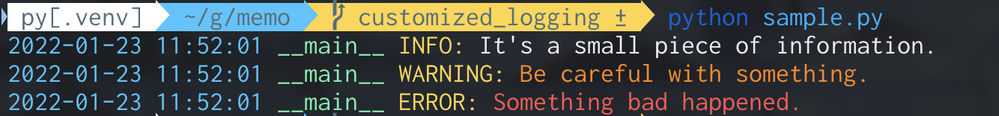

# Customized Logging

Outputs logs in a color-coded format for easy viewing.

Just use this function instead of logging.getLogger, we can unify the logging settings.

# Example

```python
from customized_logging import get_logger

logger = get_logger(__name__)

if __name__ == "__main__":
    logger.info("It's a small piece of information.")
    logger.warning("Be careful with something.")
    logger.error("Something bad happened.")
```


