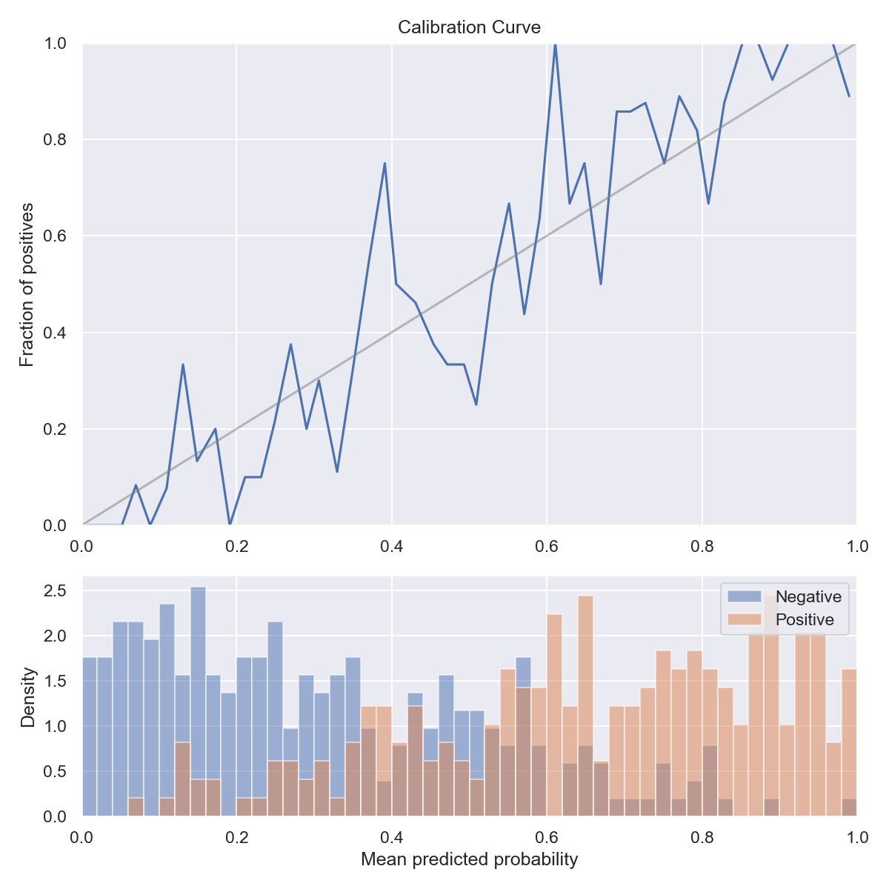

# Drawing Calibration Curve

Draw the calibration curve and data distribution.

This is in reference to [Probability calibration | scikit-learn](https://scikit-learn.org/stable/modules/calibration.html#calibration).


# Arguments

- Args:
    - y_true: True targets.
    - y_pred: Probabilities of the positive class.
    - n_bins: Number of bins to discretize the {draw_range} interval.
    - draw_range: Set the x and y limits of the figure.
    - title: Figure title.

- Returns:
    - None (With drawing figure by plt.show().)
    
# Example

```python
import numpy as np

from random import random

from draw_calibration_curve import draw_calibration_curve

y_pred = np.array([random() for _ in range(500)])
y_true = np.array([1 if random() < x else 0 for x in y_pred])

draw_calibration_curve(y_true=y_true, y_pred=y_pred, title="Calibration Curve")
```

